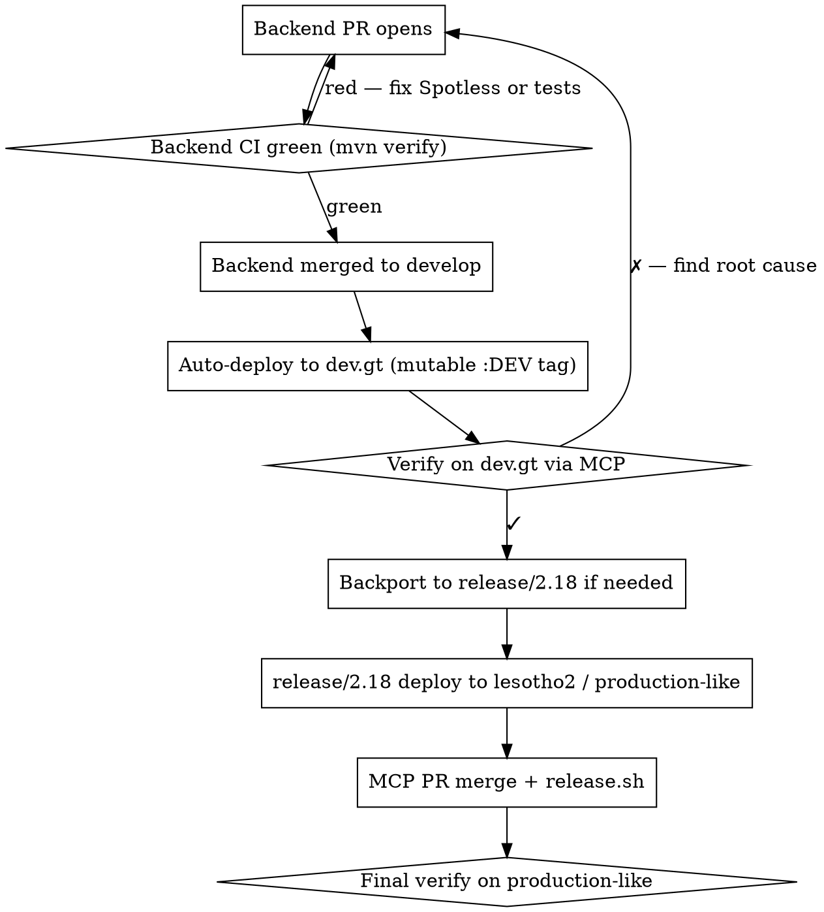

# bpa-add-history-endpoint

Adds 3 new REST endpoints to a BPA-backend controller + 2 new MCP tools, exposing the Hibernate Envers-backed revision history for an `@Audited` resource. Each revision is tagged with `created_source` (`"web"` | `"mcp"` | `"system"` | `"unknown"`) so the user can investigate "who deleted my X via the web UI?" — the original incident that motivated this pattern (MCP-eRegistrations#105).

## When to use

- A user reports a BPA resource (message, bot, cost, notification, role, etc.) silently disappeared, was renamed, or was deleted, and they want to know who/when.
- You're extending the existing `/role/{id}/history`, `/print-documents/{id}/history`, `/certificate/{id}/history`, `/service/{id}/guide-form/history`, `/service/{id}/applicant-form/history`, **or `/message/{id}/history`** pattern to a new resource.
- The user explicitly asks for "history endpoints for X" or "audit visibility for X" on the BPA platform.

## When NOT to use

- The resource is not `@Audited` (Envers tracking is opt-in per entity). Adding the annotation is a separate, high-impact change — file a separate issue.
- The resource is small/short-lived (e.g., job rows that are intentionally ephemeral).
- The user wants global cross-resource audit search — that's a different design (governance use case, needs security model). This skill is for per-resource investigation.

---

## The Iron Rule

> **`mvn spotless:apply && mvn -B verify` BEFORE every push.** Not `mvn test`. Not `mvn compile`. The CI runs `mvn clean verify -Dcheckstyle.skip=true` and Spotless binds to the `verify` phase. **A baseline subagent test on this exact pattern admitted "skipped spotless to stay in the time budget" — and that's the rationalization that broke the `develop` CI for #105 and required a follow-up fix push.**

This is not negotiable. See "Rationalization Table" below for the full list of self-deceptions that lead to a broken CI on this codebase.

---

## Reference precedent

The canonical reference is the message-history feature: [BPA-backend PR #124](https://github.com/UNCTAD-eRegistrations/BPA-backend/pull/124) + [MCP PR #112](https://github.com/UNCTAD-eRegistrations/MCP_eRegistrations/pull/112), released as MCP v1.33.0. **Read the merged squash commit `47050a25` on BPA-backend `develop` BEFORE writing any new code.** The 5 sub-changes (A1-A4 + final NoResultException fix) are the exact template you'll mirror.

Resources with the pattern ALREADY shipped (do NOT re-implement; check first):

```
/role/{id}/history                       (RoleController:279-306)
/message/{id}/history                    (MessageController, post #124)
/print-documents/{id}/history            (PrintDocumentFormController:396)
/certificate/{id}/history                (CertificateMicroPublishController:51)
/service/{id}/guide-form/history         (GuideFormPageController:253)
/service/{id}/applicant-form/history     (ApplicantFormPageController:139)
```

---

## Phase 1 — Pre-flight (5 min, MANDATORY)

Skipping pre-flight is the second-most-common trap after Spotless. Do these checks BEFORE writing any code.

### 1.1 Confirm the entity is `@Audited`

```bash
grep -A 2 "^public class <Resource> " ~/PROJECTS/00-eRegistrations-Next/BPA-backend/src/main/java/.../<Resource>.java | head -5
```

Look for `@Audited` from `org.hibernate.envers.Audited`. If absent → STOP. Adding `@Audited` is a separate change with migration implications (Envers needs to back-fill the audit table). File a separate ticket.

### 1.2 Confirm the `<resource>_aud` table exists at runtime

The annotation alone is not enough — the audit table must exist in the running database. Pre-flight on the target instance:

```bash
# Replace <DB_HOST>, <DB_USER>, <DB_NAME>, <RESOURCE> for the target instance
ssh <instance-host> 'PGPASSWORD=$DB_PASSWORD psql -U <DB_USER> -h <DB_HOST> -d <DB_NAME> -c "SELECT COUNT(*) FROM <resource>_aud;"'
```

Expected: a non-zero row count (the listener has been running and writing revisions). If 0 rows or the table is missing, the deployment hasn't been reconciling Envers schema; STOP and reconcile before proceeding.

**If you don't have SSH access to a live target instance** (local-only or test scope): document this gap explicitly in the PR description as "Pre-flight 1.2 deferred to deploying engineer — `<resource>_aud` table existence must be confirmed before merging." Do NOT silently skip without flagging — it costs you empty results in production.

### 1.3 Identify the existing single-resource GET enrichment path

Resource controllers do NOT all use the same enrichment mechanism. Identify which path the existing controller takes:

**Path A — `addXxxHistory()` private helper.** Used by: `MessageController` (post-#124). Example: `MessageController.java:227-237`. Calls `entityHistoryService.getEntityHistory(message)` and copies fields onto the entity.

```bash
grep -n "private void add<Resource>History" ~/PROJECTS/00-eRegistrations-Next/BPA-backend/src/main/java/.../<Resource>Controller.java
```

**Path B — Native query projection.** Used by: `BotController` (uses a `BotMetadata` projection from `botRepository.getMetadataByBotId()`). The single-resource GET enriches by joining audit data via SQL rather than via `EntityHistoryService`. **In this case, do NOT add an `addXxxHistory()` call** — it would be redundant or conflicting with the existing projection. The 3 new history endpoints (Phase 2.1) still apply unchanged; only the Phase 2.2 enrichment differs.

```bash
# Detect Path B
grep -n "getMetadataBy<Resource>Id\|<Resource>Metadata" ~/PROJECTS/00-eRegistrations-Next/BPA-backend/src/main/java/.../<Resource>Controller.java
```

**Path C — None.** The resource controller predates audit enrichment entirely. Adding `addXxxHistory()` is in-scope; the helper itself can be copied verbatim from `MessageController.java:227-237`.

**Decide which path applies** before writing any code. The Phase 2.2 step branches on this:
- Path A → add a one-line `addXxxHistory(r);` call inside the existing single-GET method
- Path B → SKIP Phase 2.2 entirely; the existing projection already provides equivalent data
- Path C → add the helper AND the call

### 1.4 Check if any history endpoint already exists for this resource

```bash
grep -nE "/<resource>/.*/(history|pagedhistory|schema)" ~/PROJECTS/00-eRegistrations-Next/BPA-backend/src/main/java/org/unctad/ereg/bpa/rest/controller/**/<Resource>Controller.java
```

Three possible states:

1. **No existing endpoints** → proceed to Phase 2 cleanly.

2. **Partial implementation exists** (e.g., `pagedhistory` is there but `history` and `schema` aren't) → **read the existing endpoint carefully**. The baseline test on this skill discovered that `BotController` already had a broken `pagedhistory` (called `getBotWithMappings()` which throws on deleted bots — defeating the entire point). You may need to FIX the existing endpoint to use the stub-instance pattern.

3. **Full implementation already exists on a feature branch** (e.g., someone started this work earlier and the branch is in flight). Do NOT skip the gates — instead:
   - Cherry-pick the existing commits onto a fresh validation branch off `develop`
   - Read every line to verify the stub-instance pattern is used (not `xxxRepository.getByIdOrThrow`/`getXxxWithMappings`)
   - Verify the `getXxxHistorySchema` catches `NoResultException` (the cross-repo contract; without it, the MCP recovery hint breaks)
   - Run ALL Phase 2.4 gates anyway — `mvn -B verify` is mandatory regardless of who wrote the code

---

## Phase 2 — Backend additions

### 2.1 Add 3 endpoints + 1 stub helper to `<Resource>Controller.java`

Mirror this exact structure (copy from `MessageController.java` post-#124):

```java
import org.springframework.web.bind.annotation.GetMapping;          // if not already imported
import org.unctad.ereg.bpa.database.history.EntityHistory;          // if not already imported
import org.unctad.ereg.bpa.database.history.EntityHistoryPage;       // if not already imported
import org.unctad.ereg.bpa.database.history.EntityHistoryService;    // if not already imported
import jakarta.persistence.NoResultException;                        // for the schema endpoint

// In the controller class, ensure this is autowired (most controllers already have it):
//   @Autowired private EntityHistoryService entityHistoryService;

// --- History endpoints (issue #105 pattern) ----------------------------------

/**
 * Returns up to the last 50 revisions of this <resource> in descending order.
 * Works for deleted <resource>s too — the stub-instance pattern means we don't
 * need a live row in the <resource> table to query the audit log.
 */
@GetMapping(value = "/<resource>/{<resource>_id}/history")
public List<EntityHistory> get<Resource>History(
    @PathVariable(value = "<resource>_id") String <resource>Id) {
  return entityHistoryService.getEntityHistoryList(stub<Resource>(<resource>Id));
}

/**
 * Paginated revisions in descending order.
 */
@GetMapping(value = "/<resource>/{<resource>_id}/pagedhistory")
public EntityHistoryPage getPaginated<Resource>History(
    @PathVariable(value = "<resource>_id") String <resource>Id,
    @RequestParam(defaultValue = "0") Integer pageNo,
    @RequestParam(defaultValue = "10") Integer pageSize) {
  return entityHistoryService.getPaginatedEntityHistoryList(
      stub<Resource>(<resource>Id), pageNo, pageSize);
}

/**
 * Returns the <Resource> entity AT a specific revision — the recovery primitive.
 *
 * <p>Note: For revisions where the entity was DELETED, Envers throws
 * NoResultException (not null). The MCP <resource>_revision_get tool
 * expects null in this case to surface its "request revision N-1"
 * recovery hint (issue #105). Returning null here lets Spring serialize
 * the response as 200 + JSON null body, which the MCP then handles.
 */
@GetMapping(value = "/<resource>/{<resource>_id}/history/{revision_number}/schema")
public <Resource> get<Resource>HistorySchema(
    @PathVariable(value = "<resource>_id") String <resource>Id,
    @PathVariable(value = "revision_number") Integer revisionNumber) {
  try {
    Object obj = entityHistoryService.getEntityObjectByRevisionNumberAndId(
        stub<Resource>(<resource>Id), <resource>Id, revisionNumber);
    return (<Resource>) obj;
  } catch (NoResultException e) {
    return null;
  }
}

/**
 * Build a transient <Resource> holding only the ID. EntityHistoryService uses
 * the class + id to query the <resource>_aud table; the entity does not need
 * to be persisted or have any other fields populated.
 *
 * <p><b>Why a stub instead of {@code <resource>Repository.findById}?</b> The
 * other history endpoints in this codebase (e.g. {@code RoleController#getRoleFormPageHistory})
 * look up the live entity first and return null when it's missing. That
 * design intentionally hides DELETED entities — the very case issue #105
 * needs to surface. Using a stub bypasses the live-row check and lets
 * Envers query the audit table directly by class+id, returning revisions
 * for both live AND deleted <resource>s.</p>
 */
private <Resource> stub<Resource>(String id) {
  <Resource> r = new <Resource>();
  r.setId(id);  // EntityBase @Setter generates this
  return r;
}
```

### 2.2 Enrich the single-resource GET (path-dependent — see Phase 1.3)

**Apply this step only if your resource is on Path A or Path C** (see Phase 1.3 above). Skip entirely for Path B (native query projection — already enriched).

Find the existing `GET /<resource>/{id}` method. Add `add<Resource>History(<resource>);` BEFORE any `setRoleRegistrations`-style enrichment, mirroring the list-endpoint convention:

```java
@RequestMapping(value = "/<resource>/{<resource>_id}", method = RequestMethod.GET)
public <Resource> get<Resource>(@PathVariable(value = "<resource>_id") String <resource>Id)
    throws DatabaseObjectNotFoundException {
  <Resource> r = <resource>Repository.getByIdOrThrow(<resource>Id);
  add<Resource>History(r);   // ← issue #105 enrichment
  // ... existing setX/setY calls follow ...
  return r;
}
```

For Path C (helper missing), copy the helper itself from `MessageController.java:227-237` (it's just a `entityHistoryService.getEntityHistory()` lookup with null-guarded setters).

### 2.3 Add unit tests (Mockito-only, mirrors `MessageControllerHistoryTest`)

Create `src/test/java/.../<Resource>ControllerHistoryTest.java`:

```java
@ExtendWith(MockitoExtension.class)
class <Resource>ControllerHistoryTest {

  @Mock private EntityHistoryService entityHistoryService;
  @Mock private <Resource>Repository <resource>Repository;
  // (Add other @Mock fields ONLY if the existing get<Resource>() method calls them)

  @InjectMocks
  private <Resource>Controller <resource>Controller;

  @Test
  @DisplayName("get<Resource>History delegates with stub <Resource> carrying the path-var ID")
  void get<Resource>History_delegatesWithStubMessage() {
    String id = "test-uuid";
    EntityHistory rev = new EntityHistory();
    rev.setRevisionNumber(42);
    when(entityHistoryService.getEntityHistoryList(any(<Resource>.class)))
        .thenReturn(List.of(rev));

    List<EntityHistory> result = <resource>Controller.get<Resource>History(id);

    assertEquals(1, result.size());
    verify(entityHistoryService).getEntityHistoryList(argThat(r ->
        r instanceof <Resource> && id.equals(r.getId())));
  }

  @Test
  @DisplayName("get<Resource>History works for a deleted <resource> ID — does NOT call <resource>Repository.findById")
  void get<Resource>History_worksForDeleted<Resource>() {
    when(entityHistoryService.getEntityHistoryList(any(<Resource>.class)))
        .thenReturn(List.of(new EntityHistory(), new EntityHistory()));

    List<EntityHistory> result = <resource>Controller.get<Resource>History("deleted-id");

    assertEquals(2, result.size());
    // The auditable claim — must hold or the entire feature is moot
    verify(<resource>Repository, never()).findById(any());
  }

  @Test
  @DisplayName("get<Resource>HistorySchema swallows NoResultException and returns null")
  void get<Resource>HistorySchema_swallowsNoResultException() {
    when(entityHistoryService.getEntityObjectByRevisionNumberAndId(
        any(<Resource>.class), eq("id"), eq(9999)))
        .thenThrow(new jakarta.persistence.NoResultException("no revision"));

    <Resource> result = <resource>Controller.get<Resource>HistorySchema("id", 9999);

    assertNull(result);
  }

  // Add 4-6 more tests covering: pagedhistory page params, schema happy path,
  // schema null-for-unknown-revision, get<Resource>_callsAdd<Resource>History.
}
```

**Test count target: 8 unit tests minimum** (matches `MessageControllerHistoryTest`).

**Path-specific test note:** the test asserting `addXxxHistory` is invoked from `getXxxResource()` (test #8 in `MessageControllerHistoryTest`: `getMessage_callsAddMessageHistory`) only applies for **Path A or Path C**. For **Path B (native query projection)**, replace it with a test asserting the existing metadata-projection path is unchanged — do NOT add a test that mocks `entityHistoryService.getEntityHistory()` since that's not the enrichment path actually used.

### 2.4 Mandatory pre-push gates (DO NOT SKIP)

```bash
cd ~/PROJECTS/00-eRegistrations-Next/BPA-backend

# THE iron rule for this codebase:
mvn spotless:apply
mvn -B spotless:check          # Must be clean
mvn -B test -Dtest=<Resource>ControllerHistoryTest    # Must show 8/8+ pass
mvn -B test -Dtest=<Resource>ControllerTest           # Existing tests still pass
mvn -B verify                  # The full CI-equivalent (slow, ~5-10 min, but mandatory before pushing to a release branch or merging to develop)
```

If `mvn verify` fails, do NOT push. If `mvn spotless:check` fails, run `mvn spotless:apply` and re-test.

---

## Phase 3 — MCP additions (Python, FastMCP 3.x)

### 3.1 Extend `_transform_<resource>_response` (if it exists)

Add 2 new keys to the return dict:

```python
"created_source": data.get("createdSource"),
"last_changed_source": data.get("lastChangedSource"),
```

### 3.2 Add 2 new tools

Mirror `message_history` and `message_revision_get` from `mcp_eregistrations_bpa/tools/messages.py`:

```python
MAX_HISTORY_SIZE = 100   # mirrors audit_list precedent
DEFAULT_HISTORY_SIZE = 10


def _transform_revision_summary(rev: dict[str, Any]) -> dict[str, Any]:
    """Transform an EntityHistory entry from camelCase to snake_case.

    Note: getEntityHistoryList only populates createdBy/createdWhen/
    createdSource/revisionNumber/clazz per row. lastChanged* fields are
    NOT populated for list rows by upstream design.
    """
    return {
        "revision_number": rev.get("revisionNumber"),
        "created_by": rev.get("createdBy"),
        "created_when": rev.get("createdWhen"),
        "created_source": rev.get("createdSource"),
        "clazz": rev.get("clazz"),
    }


async def <resource>_history(
    <resource>_id: str,
    page: int = 0,
    size: int = DEFAULT_HISTORY_SIZE,
    instance: str | None = None,
) -> dict[str, Any]:
    """List revision history for a BPA <resource>. Includes web UI changes.

    Use this tool to investigate deleted <resource>s — <resource>_get returns 404
    for deleted <resource>s, but their full audit history is retained here.
    To recover deleted CONTENT, pass a revision_number to <resource>_revision_get.

    Each revision's created_source distinguishes 'web' (BPA UI), 'mcp' (this
    tool), 'system' (automated), or 'unknown' (OIDC client not registered
    in BPA-backend's ModificationSource map).
    """
    if not <resource>_id or not <resource>_id.strip():
        raise ToolError("Cannot get history: '<resource>_id' is required.")
    if page < 0:
        page = 0
    if size <= 0:
        size = DEFAULT_HISTORY_SIZE
    size = min(size, MAX_HISTORY_SIZE)

    try:
        async with BPAClient.for_instance(instance) as client:
            try:
                data = await client.get(
                    "/<resource>/{<resource>_id}/pagedhistory",
                    path_params={"<resource>_id": <resource>_id},
                    params={"pageNo": page, "pageSize": size},
                    resource_type="<resource>",
                    resource_id=<resource>_id,
                )
            except BPANotFoundError:
                raise ToolError(
                    "Backend /<resource>/{id}/pagedhistory not available — "
                    "running an older BPA-backend that doesn't expose <resource> history "
                    "endpoints. Ask your BPA admin to upgrade."
                ) from None
    except ToolError:
        raise
    except BPAClientError as e:
        raise translate_error(e, resource_type="<resource>", resource_id=<resource>_id) from e

    return {
        "revisions": [_transform_revision_summary(r) for r in (data.get("publishList") or [])],
        "current_page": data.get("currentPage"),
        "total_items": data.get("totalItems"),
        "total_pages": data.get("totalPages"),
    }


async def <resource>_revision_get(
    <resource>_id: str,
    revision_number: int,
    instance: str | None = None,
) -> dict[str, Any]:
    """Retrieve a BPA <resource> at a specific revision (recovers deleted content)."""
    if not <resource>_id or not <resource>_id.strip():
        raise ToolError("Cannot get revision: '<resource>_id' is required.")
    if revision_number < 1:
        raise ToolError(
            "revision_number must be at least 1 (Envers numbers revisions "
            "starting at 1). Use '<resource>_history' to see valid numbers."
        )

    try:
        async with BPAClient.for_instance(instance) as client:
            try:
                data = await client.get(
                    "/<resource>/{<resource>_id}/history/{revision_number}/schema",
                    path_params={
                        "<resource>_id": <resource>_id,
                        "revision_number": str(revision_number),
                    },
                    resource_type="<resource>",
                    resource_id=<resource>_id,
                )
            except BPANotFoundError:
                raise ToolError(
                    f"Revision {revision_number} not found for <resource> "
                    f"'{<resource>_id}'. If this is the DELETE revision, request "
                    f"revision {revision_number - 1} instead — Envers cannot "
                    f"return content at the delete revision itself, but the "
                    f"revision immediately before it has the last live state. "
                    f"Use '<resource>_history' to see all valid revision numbers."
                ) from None
    except ToolError:
        raise
    except BPAClientError as e:
        raise translate_error(e, resource_type="<resource>", resource_id=<resource>_id) from e

    if data is None:
        # Backend returned 200 with JSON null body (Envers at a DELETE revision)
        raise ToolError(
            f"Revision {revision_number} for <resource> '{<resource>_id}' has no "
            f"retrievable content. This is likely the DELETE revision itself. "
            f"Request revision {revision_number - 1} to recover the last live state."
        )

    return _transform_<resource>_response(data)
```

### 3.3 Register the new tools

In `register_<resource>_tools(mcp)`:

```python
mcp.tool(annotations=READ)(<resource>_history)         # issue #105
mcp.tool(annotations=READ)(<resource>_revision_get)    # issue #105
```

Add to `__all__` at the top of the module too.

### 3.4 Tests (mirror `tests/test_tools/test_messages.py` `TestMessageHistory` + `TestMessageRevisionGet`)

Required tests (9 minimum):
1. `test_returns_revisions_with_source_field` — happy path + outgoing call shape (path_params, params)
2. `test_size_clamped_to_max` — size=5000 → outgoing pageSize=100
3. `test_backend_404_raises_specific_tool_error` — BPANotFoundError → ToolError mentions "older BPA-backend"
4. `test_returns_historical_content` — happy path for revision_get
5. `test_404_guides_to_previous_revision` — BPANotFoundError on revision → ToolError with N-1 + "DELETE" + "<resource>_history"
6. `test_null_body_indicates_delete_revision` — `data=None` → ToolError mentions "no retrievable content"
7. `test_revision_zero_rejected` — revision_number=0 → ToolError mentions "at least 1" + "<resource>_history"
8. `test_transform_includes_created_source` — transform mapper handles new fields
9. `test_history_tools_registered` — both tools appear in `mcp.list_tools()`

### 3.5 Mandatory pre-push gates

```bash
cd ~/PROJECTS/software-factory/MCP_eRegistrations_BPA
uv run pytest tests/test_tools/test_<resource>s.py -v
uv run ruff check src/mcp_eregistrations_bpa/tools/<resource>s.py tests/test_tools/test_<resource>s.py
uv run ruff format --check src/mcp_eregistrations_bpa/tools/<resource>s.py tests/test_tools/test_<resource>s.py
uv run mypy src/mcp_eregistrations_bpa/tools/<resource>s.py
```

---

## Phase 4 — Cross-repo deploy + live verification

The pattern is two PRs (backend first, MCP second). DO NOT merge MCP before backend is deployed.



### Live verification probe (run on dev.gt first, then any production-like target)

```python
# Replace <resource>, <id> per the resource you added
# 1. Connectivity probe
mcp__BPA__<resource>_history(instance="guatemala-dev", <resource>_id="<known-id>", size=5)
# Expected: real EntityHistoryPage with 1+ revisions, NOT "older BPA-backend" ToolError

# 2. Source-tag verification — full lifecycle
mcp__BPA__<resource>_create(instance="guatemala-dev", name="ISSUE-X-VERIFY", code="ISSUE_X")
# Note the returned id. Then:
mcp__BPA__<resource>_history(instance="guatemala-dev", <resource>_id=<id>)
# Assert: 1 revision with `created_source: "mcp"`

mcp__BPA__<resource>_get(instance="guatemala-dev", <resource>_id=<id>)
# Assert: created_by, last_changed_by, created_source, last_changed_source all populated

mcp__BPA__<resource>_update(instance="guatemala-dev", <resource>_id=<id>, ...)
mcp__BPA__<resource>_history(instance="guatemala-dev", <resource>_id=<id>)
# Assert: 2 revisions, both with `created_source: "mcp"`

# 3. DELETE-revision recovery — the central use case
mcp__BPA__<resource>_delete(instance="guatemala-dev", <resource>_id=<id>)
mcp__BPA__<resource>_history(instance="guatemala-dev", <resource>_id=<id>)
# Note the DELETE revision number = N. Assert 3 revisions total.

mcp__BPA__<resource>_revision_get(instance="guatemala-dev", <resource>_id=<id>, revision_number=N)
# Assert: ToolError mentions "request revision N-1 instead" — proves the cross-repo
# NoResultException catch is working. If you get a generic 500 here, the backend's
# getXxxHistorySchema is not catching NoResultException — fix backend before merging.

mcp__BPA__<resource>_revision_get(instance="guatemala-dev", <resource>_id=<id>, revision_number=N-1)
# Assert: returns the original content (recovery primitive works)

# 4. Size clamp
mcp__BPA__<resource>_history(instance="guatemala-dev", <resource>_id=<id>, size=5000)
# Assert: no error, response respects the clamp
```

---

## Phase 5 — Commit messages + PR descriptions

Use conventional commits per the BPA-backend project conventions. Every release-relevant commit body must answer:

1. What scenario used to fail / be confusing?
2. What does the new behavior look like?
3. What does the caller need to do differently?

Backend commit subject template: `feat(<resource>): expose @Audited revision history via REST`
MCP commit subject template: `feat(bpa): add <resource>_history and <resource>_revision_get tools`

NEVER mention AI / Claude / LLM / Anthropic in commit messages or PR bodies on this codebase.

---

## Rationalization Table

Captured from baseline subagent testing on this exact pattern. Every excuse below has been observed in the wild on this codebase and has cost real CI time / debugging time.

| Rationalization | Reality | Cost when ignored |
|---|---|---|
| "I'll skip `mvn spotless:check` to stay in the time budget" | Spotless binds to `verify`, runs in CI. Skipping breaks `develop` CI on push. | One follow-up PR, ~30 min CI debugging, "stale info" lease push complications |
| "`mvn test` is enough for local validation" | CI runs `mvn clean verify -Dcheckstyle.skip=true`. `verify` runs Spotless + Failsafe; `test` does not. | Same as above — Spotless violation lands on develop |
| "I'll just look at the @Audited annotation" | The annotation alone doesn't guarantee the audit table exists at runtime. | Tools ship and return empty results — feature dead on arrival |
| "The existing `pagedhistory` endpoint already exists, I'll skip it" | Baseline test discovered `BotController.getPaginatedApplicantFormPageHistory` was BROKEN for deleted bots (called `getBotWithMappings` which throws). Always read the existing endpoint to verify it uses the stub-instance pattern. | Live verification fails on the deleted-resource case |
| "I'll only run unit tests, the live probe can wait" | Mocked tests pass with kwargs the real client rejects (memory: `feedback_mocks_lie_about_signatures.md`). Live probe is the binding test. | Tool ships broken; user discovers in production |
| "I'll use `git push --force` since I just rebased" | Use `--force-with-lease` for safety; even better, rebase only when actually needed. Force push without lease can clobber concurrent pushes. | Loss of others' work in worst case |
| "Cherry-picking the squash-merge will work everywhere" | The squash-merge only applies cleanly if the target branch has the same prerequisites (e.g. `add<Resource>History` helper, `ModificationSource` enum). On older release branches, prerequisites may be missing. | Hour+ of conflict resolution OR shipping broken code |
| "I'll add `@Audited` to the entity if it's missing" | Adding `@Audited` to a long-lived entity is a separate, high-impact change with migration implications (Envers schema reconciliation). It's NOT in scope for this skill. | Can break existing audit data integrity |
| "I'll skip the cross-repo coordination (backend first, MCP second)" | If MCP merges before backend is deployed, the new MCP tools 404 on every call until backend lands. | Released MCP tool is broken until backend deploys; user-facing impact |
| "I'll skip the NoResultException catch — it's an edge case" | Without it, MCP `<resource>_revision_get(delete_rev)` returns generic 500 instead of the carefully-designed "request revision N-1" hint. The whole recovery story breaks at the central use case. | The user-facing recovery primitive doesn't work for the original incident scenario |

---

## Red Flags — STOP and re-read this skill

If you find yourself thinking any of the following, STOP and re-read the relevant section:

- "I don't need to run mvn verify, mvn test is fine" → **Phase 2.4. Spotless will fail you.**
- "I'll skip the @Audited check, the entity probably has it" → **Phase 1.1**
- "I'll skip the audit table check, the annotation is enough" → **Phase 1.2**
- "The existing endpoint already does this" → **Phase 1.4. Read it carefully.**
- "I'll cherry-pick onto release/2.17, it should be fine" → **Rationalization table. Check prerequisites.**
- "Force-push is fine here" → **Use `--force-with-lease`. Always.**
- "I'll merge the MCP PR before the backend deploys" → **Phase 4. The tools will 404.**
- "Mocked tests are sufficient" → **Live verification on dev.gt is mandatory before claiming done.**

---

## Quick reference — file paths

| What | Where (BPA-backend) | Where (MCP) |
|---|---|---|
| Resource controller | `src/main/java/.../<Resource>Controller.java` | n/a |
| Controller history test | `src/test/java/.../<Resource>ControllerHistoryTest.java` | n/a |
| Existing precedent reference | `src/main/java/.../MessageController.java` (post-#124) | `src/mcp_eregistrations_bpa/tools/messages.py` (post-#112) |
| Resource entity | `src/main/java/.../<Resource>.java` | n/a |
| EntityHistoryService | `src/main/java/org/unctad/ereg/bpa/database/history/EntityHistoryService.java` | n/a |
| ModificationSource enum | `src/main/java/org/unctad/ereg/bpa/model/ModificationSource.java` | n/a |
| Tool module | n/a | `src/mcp_eregistrations_bpa/tools/<resource>s.py` |
| Tool tests | n/a | `tests/test_tools/test_<resource>s.py` |
| Workflow file | `.github/workflows/ci-cd.yml` | `.github/workflows/release.yml` |

---

## Changelog

- 1.0.0 (2026-05-07) — Initial extraction from issue #105 working diff. Captures: 5-commit cross-repo pattern, Spotless trap, NoResultException cross-repo contract, stub-instance pattern for deleted-entity recovery, 9-test requirement on each side, live verification probe sequence, rationalization table from baseline subagent testing.
- 1.0.1 (2026-05-07) — GREEN-test refactor: explicit Path A/B/C branching for the single-resource GET enrichment (not all resources use the `addXxxHistory` helper — Bot uses a `BotMetadata` native query projection). Added "no SSH access" fallback for Phase 1.2. Added "full implementation already on in-flight branch" handling for Phase 1.4. Clarified test count phrasing.
